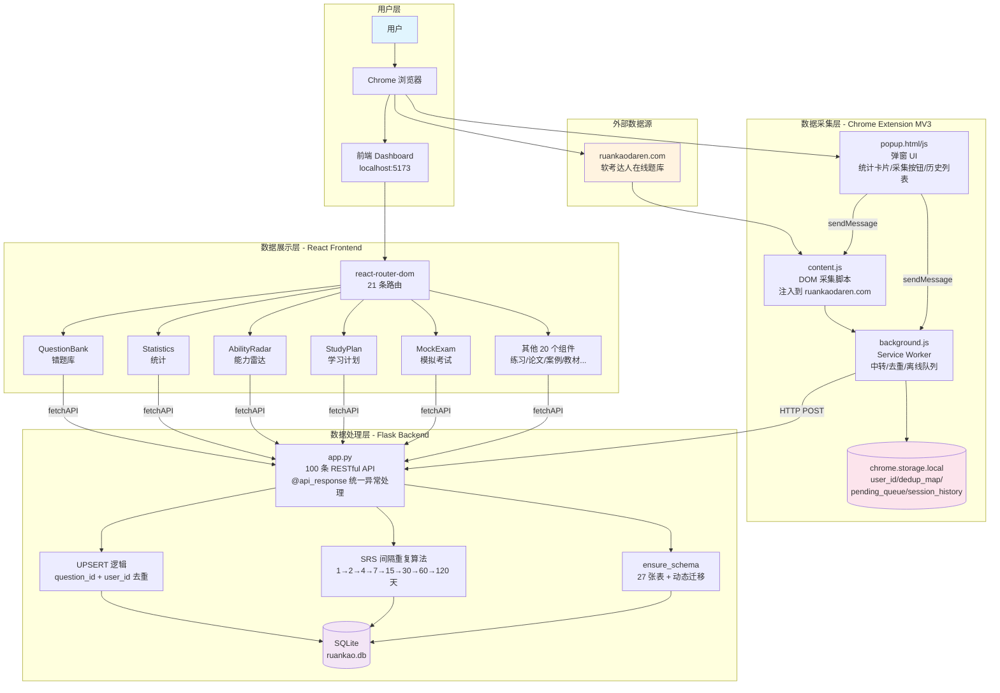
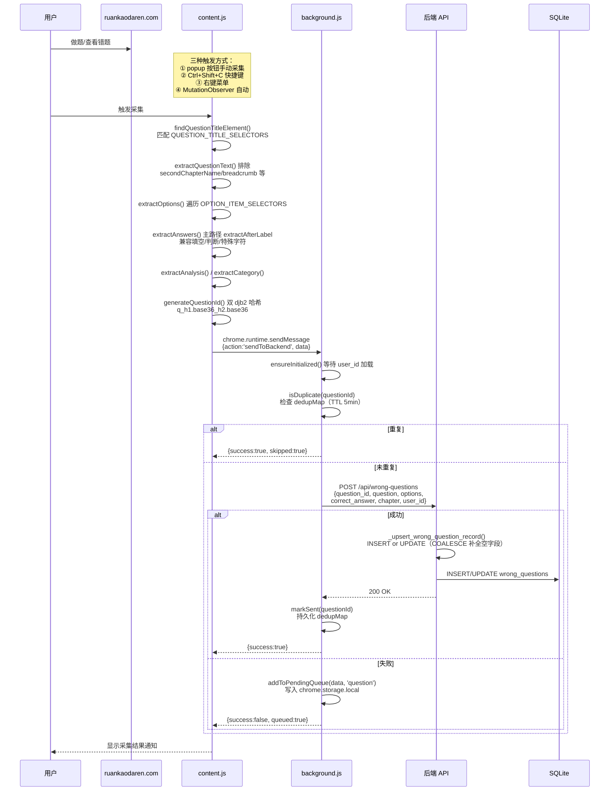
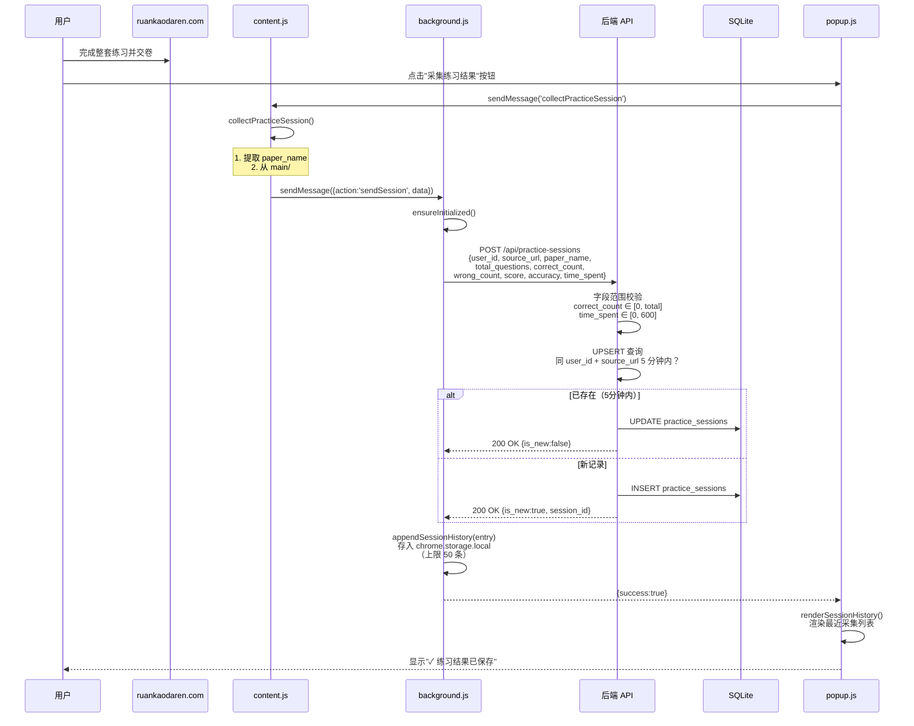
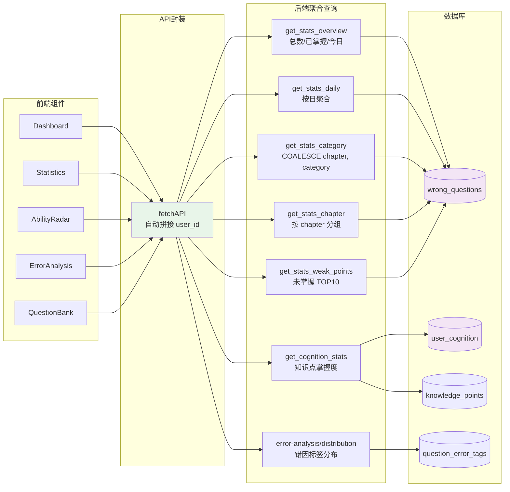
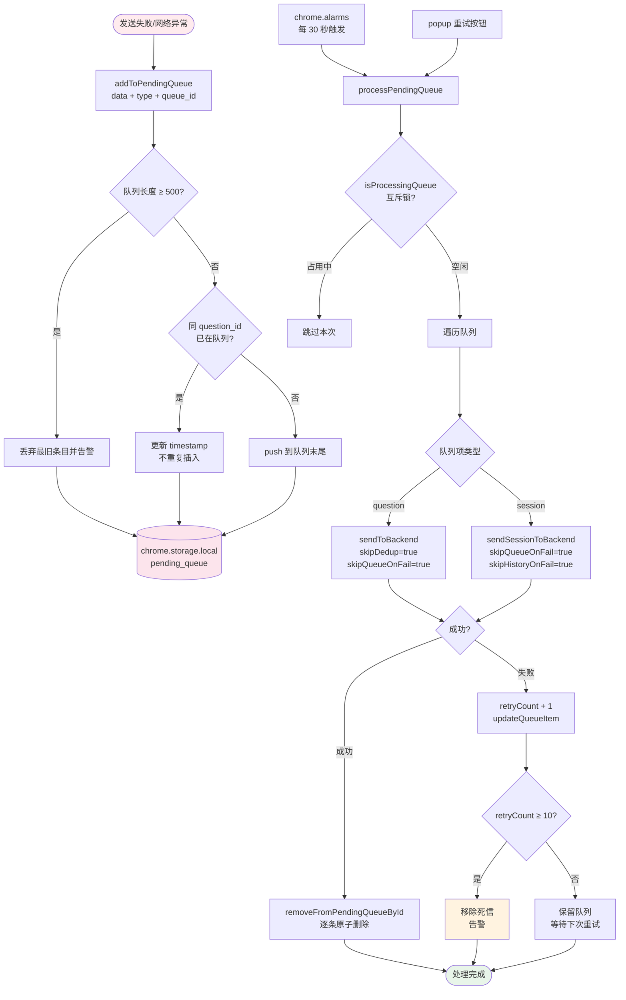

# 软考错题分析系统 - 项目架构与数据流文档

> 生成时间：2026-07-05
> 项目路径：`/Users/wanglongzhen/Downloads/ruankao-xtjgs`
> 技术栈：Flask + SQLite（后端）、React + Vite（前端）、Chrome Extension MV3（插件）

---

## 目录

- [一、项目总览](#一项目总览)
- [二、功能架构图](#二功能架构图)
- [三、模块详解](#三模块详解)
  - [3.1 后端模块（backend/）](#31-后端模块backend)
  - [3.2 前端模块（src/）](#32-前端模块src)
  - [3.3 浏览器插件模块（plugin/）](#33-浏览器插件模块plugin)
- [四、数据流图](#四数据流图)
  - [4.1 错题采集流](#41-错题采集流)
  - [4.2 练习会话流](#42-练习会话流)
  - [4.3 统计分析流](#43-统计分析流)
  - [4.4 离线队列容错流](#44-离线队列容错流)
- [五、数据库表关系](#五数据库表关系)
- [六、关键架构特征](#六关键架构特征)

---

## 一、项目总览

```
ruankao-xtjgs/
├── backend/          # Flask + SQLite 后端（单文件 app.py，~6500 行，100 条 API 路由）
├── src/              # React + Vite 前端（25 个业务组件，21 条路由）
├── plugin/           # Chrome Extension MV3（content.js + background.js + popup）
├── dist/             # 前端构建产物
├── docc/             # 教材资料（PDF/Markdown）
├── scripht/          # PDF 转 Markdown 脚本
└── package.json / vite.config.js
```

**三层架构**：
- **数据采集层**：Chrome 插件从 ruankaodaren.com 抓取题目 DOM、答案、解析、练习结果
- **数据处理层**：Flask 后端接收数据，UPSERT 入库 SQLite，提供 100 条 RESTful API
- **数据展示层**：React 前端消费 API，渲染 21 个功能页面（错题库、统计、计划等）

---

## 二、功能架构图



---

## 三、模块详解

### 3.1 后端模块（backend/）

**核心文件**：`app.py`（~6500 行，单文件架构）

**核心工具函数**：

| 函数 | 职责 |
|---|---|
| `@api_response` | 统一异常处理：ValueError→400、KeyError→400、其他→500 |
| `@rate_limit` | 按 IP 限流（120 次/分钟） |
| `get_db_conn()` | SQLite 连接上下文管理器 |
| `sanitize_string()` | 字符串清洗（strip/截断/去控制字符） |
| `safe_int()` | 安全整数转换 |
| `get_user_id()` | 从 query 取 user_id（默认 default_user） |
| `get_pagination_params()` | 分页参数解析（limit ≤ 100） |
| `ensure_schema()` | 建表 + 动态 ALTER TABLE 迁移 |

**API 路由分组**（共 100 条）：

| 分组 | 路由数 | 代表性路由 |
|---|---|---|
| 健康检查/元信息 | 3 | `/api/health`、`/api/feature-flags` |
| 错题管理 | 14 | `POST /api/wrong-questions`、`/api/wrong-questions/batch`、`/analysis`、`/export/csv` |
| 练习会话采集 | 2 | `POST /api/practice-sessions`（UPSERT 5 分钟窗口） |
| 练习出题与作答 | 8 | `/api/practice/random`、`/submit-real-exam` |
| 统计分析 | 8 | `/api/stats/overview`、`/category`、`/chapter`、`/weak-points`、`/cognition` |
| 知识点/知识图谱 | 4 | `/api/knowledge/tree`、`/weakest`、`/progress` |
| 学习计划 | 6 | `POST /api/study-plan`、`/tasks/<id>/complete`、`/regenerate` |
| 模拟考试 | 8 | `/api/mock-exam/create`、`/start`、`/answer`、`/submit`、`/result` |
| 错题诊断/错因分析 | 8 | `/api/error-analysis/analyze/<id>`、`/distribution`、`/trend` |
| 笔记/收藏/闪卡 | 10 | `/api/notes`、`/favorites`、`/flashcards/<id>/review` |
| 论文训练 | 6 | `/api/essay/topics`、`/submit`、`/stats` |
| 案例分析 | 6 | `/api/case/questions`、`/submit`、`/stats` |
| 教材学习 | 5 | `/api/textbook/chapters`、`/progress`、`/search` |
| 真题模考 | 3 | `/api/real-exam/questions`、`/start` |
| 考纲/打卡/学习会话 | 7 | `/api/syllabus/coverage`、`POST /api/checkin`、`/api/study-session` |

### 3.2 前端模块（src/）

**技术栈**：React 18.3 + Vite 6 + react-router-dom 6.28（无 UI 框架，纯 CSS）

**路由配置**（21 条）：

| 路径 | 组件 | 功能 |
|---|---|---|
| `/` | Dashboard | 总览仪表盘 |
| `/questions` | QuestionBank | 错题库 |
| `/practice` | Practice | 练习 |
| `/statistics` | Statistics | 统计 |
| `/analysis` | ErrorAnalysis | 错题分析 |
| `/exam` | MockExam | 模拟考试 |
| `/real-exam` | RealExam | 真题模考 |
| `/review` | ReviewQueue | 今日复习（SRS） |
| `/radar` | AbilityRadar | 能力雷达 |
| `/diagnosis` | ErrorDiagnosis | 错题诊断 |
| `/knowledge` | KnowledgeGraph | 知识图谱 |
| `/textbook` | Textbook | 教材学习 |
| `/learning-path` | LearningPath | 学习路径 |
| `/plan` | StudyPlan | 学习计划 |
| `/checkin` | StudyCheckin | 学习打卡 |
| `/essay` | EssayTraining | 论文训练 |
| `/case` | CaseAnalysis | 案例分析 |
| `/notebook` | Notebook | 笔记 |
| `/custom-questions` | CustomQuestions | 我的题库 |
| `/syllabus` | SyllabusCoverage | 考纲覆盖 |
| `/report` | LearningReport | 学习报告 |

**API 封装**：`src/utils/api.js`
- `API_BASE`：从 `VITE_API_BASE` 环境变量读取
- `fetchAPI(url, options)`：自动拼接 `user_id` 查询参数
- 导出 30+ 个具名 API 函数

### 3.3 浏览器插件模块（plugin/）

**manifest.json 关键配置**：
- `permissions`：activeTab、scripting、storage、tabs、contextMenus、alarms
- `host_permissions`：`*.ruankaodaren.com/*`、`localhost:5002/*`
- `content_scripts`：注入 `content.js` 到 ruankaodaren.com（document_end）
- `background`：service_worker `background.js`
- `commands`：`Ctrl+Shift+C` 采集当前题目

**文件职责**：

| 文件 | 职责 |
|---|---|
| `content.js` (~1200 行) | DOM 采集：题目/选项/答案/解析/章节；批量采集；练习会话采集；SPA 导航监听 |
| `background.js` (~640 行) | Service Worker：user_id 管理、去重（dedupMap TTL 5min）、离线队列、重试、批量分片 |
| `popup.html/js` | 弹窗 UI：统计卡片、采集按钮、队列状态、会话历史、user_id 配置 |

**关键常量**：
- `DEDUP_TTL = 5 * 60 * 1000`（5 分钟去重窗口）
- `MAX_RETRIES = 3`（单次发送重试次数）
- `ALARM_INTERVAL = 0.5`（30 秒重试周期）
- `BATCH_CHUNK_SIZE = 200`（批量分片大小）
- `SESSION_HISTORY_LIMIT = 50`
- `PENDING_QUEUE_LIMIT = 500`
- `MAX_ITEM_RETRIES = 10`（死信阈值）

---

## 四、数据流图

### 4.1 错题采集流



### 4.2 练习会话流



### 4.3 统计分析流



### 4.4 离线队列容错流



---

## 五、数据库表关系

```mermaid
erDiagram
    knowledge_points ||--o{ user_cognition : "kp_id"
    knowledge_points ||--o{ question_mapping : "kp_id"
    knowledge_points ||--o{ daily_tasks : "kp_id"
    knowledge_points ||--o{ flashcards : "kp_id"
    knowledge_points ||--o{ notes : "kp_id"
    knowledge_points ||--o{ real_exam_questions : "kp_id"
    knowledge_points ||--o{ custom_questions : "kp_id"
    knowledge_points ||--o{ mock_exam_questions : "kp_id"
    knowledge_points }o--|| knowledge_points : "parent_id 自引用"

    study_plans ||--o{ daily_tasks : "plan_id"
    mock_exams ||--o{ mock_exam_questions : "exam_id"

    practice_attempts ||--o{ practice_reflections : "attempt_id"
    error_patterns ||--o{ practice_attempts : "error_pattern_id"

    wrong_questions ||--o{ question_error_tags : "question_id"
    error_tags ||--o{ question_error_tags : "tag_id"

    textbook_chapters ||--o{ reading_progress : "chapter_id"
    textbook_chapters }o--|| textbook_chapters : "parent_id"

    essay_topics ||--o{ essay_submissions : "topic_id"
    case_questions ||--o{ case_submissions : "case_id"

    wrong_questions {
        TEXT question_id PK
        TEXT user_id
        TEXT question
        TEXT chapter
        TEXT category
        TEXT correct_answer
        INTEGER is_mastered
        INTEGER srs_stage
        DATETIME next_review_time
        INTEGER wrong_count
        INTEGER error_count
    }

    practice_sessions {
        INTEGER id PK
        TEXT user_id
        TEXT source_url
        TEXT paper_name
        INTEGER total_questions
        INTEGER correct_count
        REAL score
        REAL accuracy
        INTEGER time_spent
        DATETIME started_at
        DATETIME submitted_at
    }

    knowledge_points {
        INTEGER id PK
        TEXT name
        TEXT chapter
        INTEGER parent_id
        INTEGER level
        REAL exam_weight
        INTEGER is_active
    }

    user_cognition {
        INTEGER id PK
        INTEGER kp_id
        TEXT user_id
        REAL mastery_score
        REAL stability
    }

    flashcards {
        INTEGER id PK
        TEXT user_id
        INTEGER kp_id
        TEXT front
        TEXT back
        INTEGER srs_stage
        DATETIME next_review_at
    }

    mock_exams {
        INTEGER id PK
        TEXT user_id
        TEXT title
        TEXT status
        INTEGER total_questions
        REAL score
    }

    study_plans {
        INTEGER id PK
        TEXT user_id
        DATE exam_date
        TEXT status
    }

    daily_tasks {
        INTEGER id PK
        INTEGER plan_id
        TEXT user_id
        DATE task_date
        TEXT status
        INTEGER kp_id
    }
```



**多用户隔离**：18 张表含 `user_id` 字段（默认 `default_user`），前端/插件每次请求自动拼接 `?user_id=xxx`，后端 `get_user_id()` 解析并 sanitize。

**状态字段**：`is_mastered`（错题掌握）、`is_active`（知识点启用）、`status`（计划/任务/考试/论文等状态机）。

---

## 六、关键架构特征

### 6.1 去重与容错机制

```
双层容错：
├── dedupMap（内存 + storage，TTL 5min）
│   ├── isDuplicate() 只读检查
│   ├── markSent() 发送成功后标记
│   └── unmarkSent() 失败时清除
└── pending_queue（chrome.storage.local，上限 500）
    ├── addToPendingQueue 按 question_id 去重
    ├── processPendingQueue 逐条原子删除（按 queue_id）
    ├── retryCount + 死信移除（MAX_ITEM_RETRIES=10）
    └── isProcessingQueue 互斥锁（防 alarm+retry 并发）
```

### 6.2 SRS 间隔重复算法

```
SRS_INTERVALS = [1, 2, 4, 7, 15, 30, 60, 120]  # 天

wrong_questions:
  srs_stage → next_review_time → ReviewQueue 消费

flashcards:
  srs_stage → next_review_at → calculate_next_review()
```

### 6.3 UPSERT 数据合并策略

```sql
-- 错题 UPSERT（基于 question_id + user_id）
UPDATE wrong_questions
SET correct_answer = COALESCE(NULLIF(?, ''), correct_answer),
    options = CASE WHEN ? NOT IN ('', '[]') AND (options IS NULL OR options = '[]')
                  THEN ? ELSE options END,
    analysis = COALESCE(NULLIF(?, ''), analysis),
    chapter = COALESCE(NULLIF(?, ''), chapter),
    wrong_count = wrong_count + 1,
    error_count = error_count + 1
WHERE question_id = ? AND user_id = ?

-- 练习会话 UPSERT（基于 user_id + source_url + 5分钟窗口）
SELECT id FROM practice_sessions
WHERE user_id = ? AND source_url = ?
  AND created_at >= datetime('now', '-5 minutes')
```

### 6.4 章节聚合兼容查询

R25 后章节名存入 `chapter` 列，`category` 改为题型分类。所有分析接口使用 `COALESCE(NULLIF(chapter, ''), category)` 兼容新旧数据。

---

## 附：API 路由完整清单

| 分组 | 数量 | 代表路由 |
|---|---|---|
| 健康检查 | 3 | `/api/health`、`/api/feature-flags`、`/api/error-patterns` |
| 错题管理 | 14 | `POST /api/wrong-questions`、`/batch`、`GET /analysis`、`/export/csv` |
| 练习会话 | 2 | `POST /api/practice-sessions`、`GET /api/practice-sessions` |
| 练习作答 | 8 | `/api/practice/random`、`/submit-real-exam`、`/recommend` |
| 统计分析 | 8 | `/api/stats/overview`、`/category`、`/chapter`、`/weak-points`、`/cognition` |
| 知识图谱 | 4 | `/api/knowledge/tree`、`/weakest`、`/progress` |
| 学习计划 | 6 | `POST /api/study-plan`、`/tasks/<id>/complete`、`/regenerate` |
| 模拟考试 | 8 | `/api/mock-exam/create`、`/start`、`/submit`、`/result` |
| 错题诊断 | 8 | `/api/error-analysis/analyze/<id>`、`/distribution`、`/trend` |
| 笔记/收藏/闪卡 | 10 | `/api/notes`、`/favorites`、`/flashcards/<id>/review` |
| 论文训练 | 6 | `/api/essay/topics`、`/submit`、`/stats` |
| 案例分析 | 6 | `/api/case/questions`、`/submit`、`/stats` |
| 教材学习 | 5 | `/api/textbook/chapters`、`/progress`、`/search` |
| 真题模考 | 3 | `/api/real-exam/questions`、`/start`、`/stats` |
| 考纲/打卡 | 7 | `/api/syllabus/coverage`、`POST /api/checkin`、`/api/study-session` |

**合计**：100 条 API 路由，27 张数据库表，21 条前端路由，25 个 React 组件，5 个插件文件。
